# Examples

| [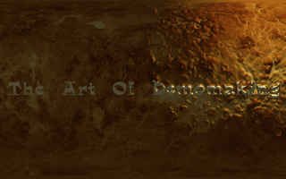](https://jdiemke.github.io/aisa/bump-map.html) [2D Bump Mapping](https://jdiemke.github.io/aisa/bump-map.html) |  [Abstract Cube](https://jdiemke.github.io/aisa/abstract-cube.html) | [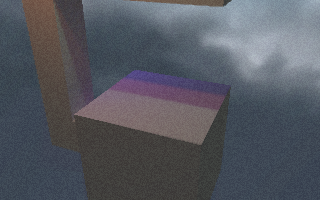](https://jdiemke.github.io/aisa/baked-lighting.html) [Baked Lighting](https://jdiemke.github.io/aisa/baked-lighting.html) |
|:---:|:---:|:---:|
| [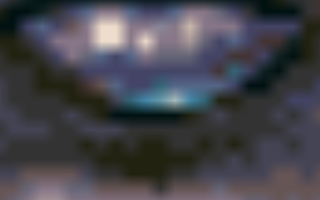](https://jdiemke.github.io/aisa/bilinear-zoom.html) [Bilinear Zoom](https://jdiemke.github.io/aisa/bilinear-zoom.html) | [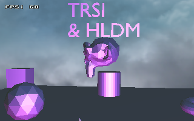](https://jdiemke.github.io/aisa/blender-camera.html) [Blender Camera Export](https://jdiemke.github.io/aisa/blender-camera.html) | [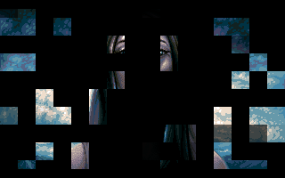](https://jdiemke.github.io/aisa/block-fade.html) [Block Fade](https://jdiemke.github.io/aisa/block-fade.html) |
| [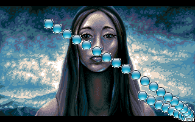](https://jdiemke.github.io/aisa/bobs.html) [Bobs](https://jdiemke.github.io/aisa/bobs.html) | [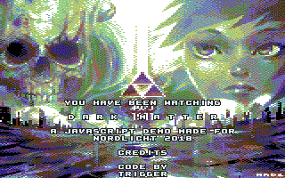](https://jdiemke.github.io/aisa/cinematic-scroller.html) [Cinematic Scroller](https://jdiemke.github.io/aisa/cinematic-scroller.html) | [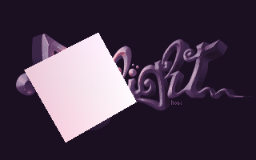](https://jdiemke.github.io/aisa/cube.html) [Cube](https://jdiemke.github.io/aisa/cube.html) |
| [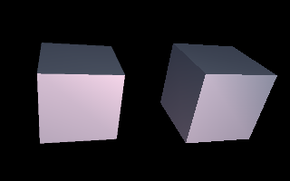](https://jdiemke.github.io/aisa/cube-subpixel.html) [Cube Subpixel](https://jdiemke.github.io/aisa/cube-subpixel.html) | [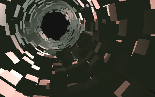](https://jdiemke.github.io/aisa/cube-tunnel.html) [Cube Tunnel](https://jdiemke.github.io/aisa/cube-tunnel.html) | [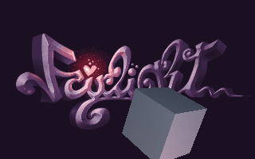](https://jdiemke.github.io/aisa/voxel-balls.html) [Cubes](https://jdiemke.github.io/aisa/voxel-balls.html) |
| [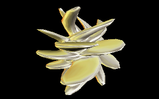](https://jdiemke.github.io/aisa/distorted-sphere.html) [Distorted Sphere](https://jdiemke.github.io/aisa/distorted-sphere.html) | [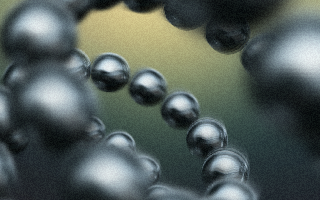](https://jdiemke.github.io/aisa/dof-balls.html) [DOF Balls](https://jdiemke.github.io/aisa/dof-balls.html) | [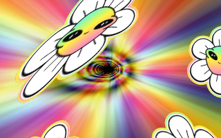](https://jdiemke.github.io/aisa/domain-warping.html) [Domain Warping](https://jdiemke.github.io/aisa/domain-warping.html) |
| [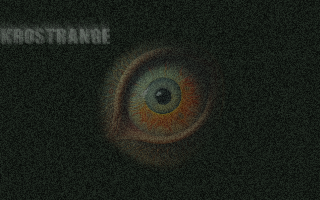](https://jdiemke.github.io/aisa/endless-zoom.html) [Endless Zoom](https://jdiemke.github.io/aisa/endless-zoom.html) | [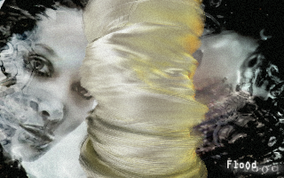](https://jdiemke.github.io/aisa/environment-mapping-cylinder.html) [Environment Mapping Cylinder](https://jdiemke.github.io/aisa/environment-mapping-cylinder.html) | [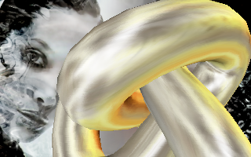](https://jdiemke.github.io/aisa/environment-mapping-torus.html) [Environment Mapping Torus](https://jdiemke.github.io/aisa/environment-mapping-torus.html) |
| [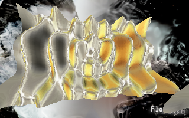](https://jdiemke.github.io/aisa/environment-mapping-waves.html) [Environment Mapping Waves](https://jdiemke.github.io/aisa/environment-mapping-waves.html) | [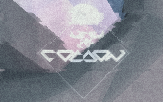](https://jdiemke.github.io/aisa/feedback-radial-blur.html) [Feedback Radial Blur](https://jdiemke.github.io/aisa/feedback-radial-blur.html) |  [Fire](https://jdiemke.github.io/aisa/fire.html) |
| [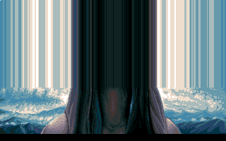](https://jdiemke.github.io/aisa/flood-fill.html) [Flood Fill](https://jdiemke.github.io/aisa/flood-fill.html) | [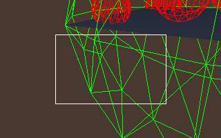](https://jdiemke.github.io/aisa/frustum-culling.html) [Frustum Culling](https://jdiemke.github.io/aisa/frustum-culling.html) | [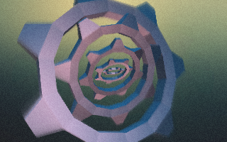](https://jdiemke.github.io/aisa/gears.html) [Gears](https://jdiemke.github.io/aisa/gears.html) |
| [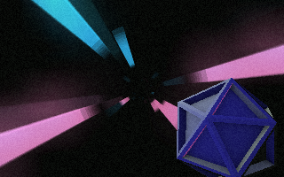](https://jdiemke.github.io/aisa/glow.html) [Glow](https://jdiemke.github.io/aisa/glow.html) | [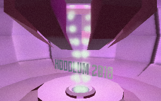](https://jdiemke.github.io/aisa/hoodlum.html) [Hoodlum](https://jdiemke.github.io/aisa/hoodlum.html) | [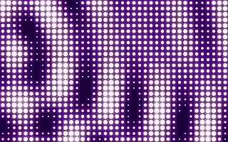](https://jdiemke.github.io/aisa/led-plasma.html) [LED Plasma](https://jdiemke.github.io/aisa/led-plasma.html) |
|  [LED Tunnel](https://jdiemke.github.io/aisa/led-tunnel.html) | [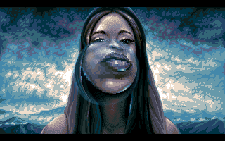](https://jdiemke.github.io/aisa/lens.html) [Lens](https://jdiemke.github.io/aisa/lens.html) |  [Metaballs](https://jdiemke.github.io/aisa/metaballs.html) |
| [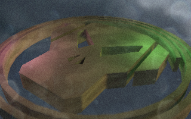](https://jdiemke.github.io/aisa/metalheadz.html) [Metalheadz](https://jdiemke.github.io/aisa/metalheadz.html) | [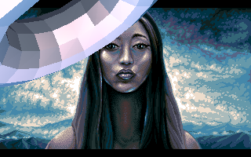](https://jdiemke.github.io/aisa/moving-torus.html) [Moving Torus](https://jdiemke.github.io/aisa/moving-torus.html) | [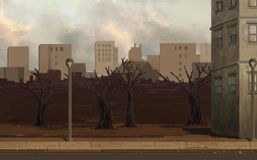](https://jdiemke.github.io/aisa/xenusion.html) [Paralax](https://jdiemke.github.io/aisa/xenusion.html) |
| [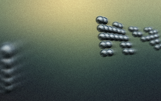](https://jdiemke.github.io/aisa/particle-scroller.html) [Particle Scroller](https://jdiemke.github.io/aisa/particle-scroller.html) | [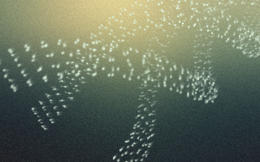](https://jdiemke.github.io/aisa/particle-streams.html) [Particle Streams](https://jdiemke.github.io/aisa/particle-streams.html) | [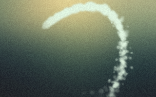](https://jdiemke.github.io/aisa/particle-system.html) [Particle System](https://jdiemke.github.io/aisa/particle-system.html) |
| [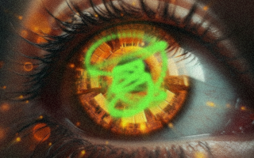](https://jdiemke.github.io/aisa/particle-torus.html) [Particle Torus](https://jdiemke.github.io/aisa/particle-torus.html) | [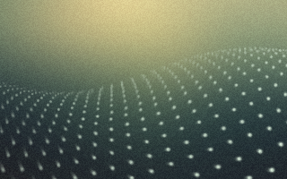](https://jdiemke.github.io/aisa/particle-waves.html) [Particle Waves](https://jdiemke.github.io/aisa/particle-waves.html) | [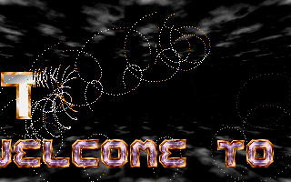](https://jdiemke.github.io/aisa/pixel-effect.html) [Pixel Effect](https://jdiemke.github.io/aisa/pixel-effect.html) |
| [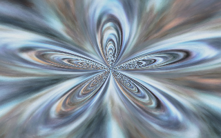](https://jdiemke.github.io/aisa/plane-deformation.html) [Plane Deformation](https://jdiemke.github.io/aisa/plane-deformation.html) | [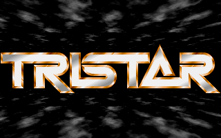](https://jdiemke.github.io/aisa/plane-deformation-floor.html) [Plane Deformation Floor](https://jdiemke.github.io/aisa/plane-deformation-floor.html) | [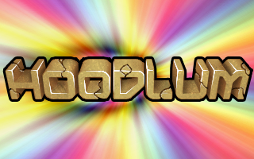](https://jdiemke.github.io/aisa/plane-deformation-tunnel.html) [Plane Deformation Tunnel](https://jdiemke.github.io/aisa/plane-deformation-tunnel.html) |
| [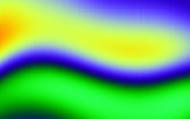](https://jdiemke.github.io/aisa/plasma.html) [Plasma](https://jdiemke.github.io/aisa/plasma.html) | [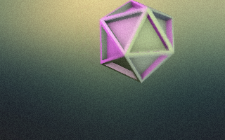](https://jdiemke.github.io/aisa/platonian.html) [Platonian](https://jdiemke.github.io/aisa/platonian.html) | [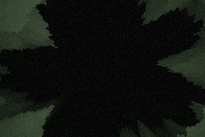](https://jdiemke.github.io/aisa/polar-voxels.html) [Polar Voxel Landscape](https://jdiemke.github.io/aisa/polar-voxels.html) |
| [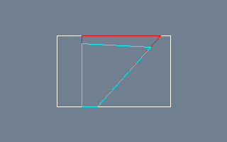](https://jdiemke.github.io/aisa/portals.html) [Portal Engine](https://jdiemke.github.io/aisa/portals.html) | [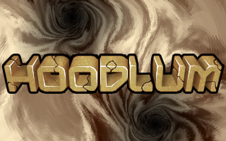](https://jdiemke.github.io/aisa/psychadelic-plane-deformation.html) [Psychadelic Plane Deformation](https://jdiemke.github.io/aisa/psychadelic-plane-deformation.html) | [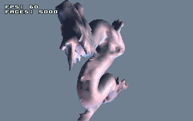](https://jdiemke.github.io/aisa/mdl.html) [Quake 1 Model](https://jdiemke.github.io/aisa/mdl.html) |
| [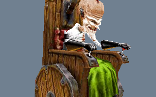](https://jdiemke.github.io/aisa/md2.html) [Quake 2 Model (Dr. Freak)](https://jdiemke.github.io/aisa/md2.html) | [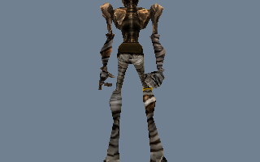](https://jdiemke.github.io/aisa/other-md2.html) [Quake 2 Model (Ratamahatta)](https://jdiemke.github.io/aisa/other-md2.html) | [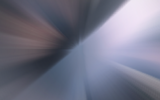](https://jdiemke.github.io/aisa/radial-blur.html) [Radial Blur](https://jdiemke.github.io/aisa/radial-blur.html) |
| [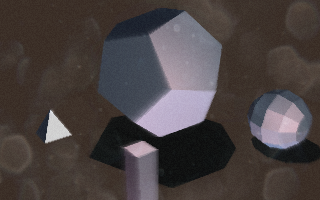](https://jdiemke.github.io/aisa/razor.html) [Razor Scene](https://jdiemke.github.io/aisa/razor.html) | [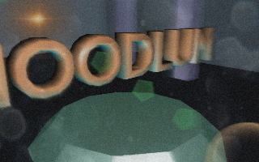](https://jdiemke.github.io/aisa/room.html) [Room](https://jdiemke.github.io/aisa/room.html) | [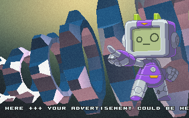](https://jdiemke.github.io/aisa/rotating-gears.html) [Rotating Gears (w. XM Music)](https://jdiemke.github.io/aisa/rotating-gears.html) |
|  [Roto Zoomer](https://jdiemke.github.io/aisa/roto-zoomer.html) |  [Scrolling Background](https://jdiemke.github.io/aisa/scrolling-background.html) |  [Shrooms](https://jdiemke.github.io/aisa/shrooms.html) |
|  [Sine Scroller (w. XM Music)](https://jdiemke.github.io/aisa/sine-scroller.html) |  [SNES Mode7](https://jdiemke.github.io/aisa/mode-7.html) |  [Stanford Bunny](https://jdiemke.github.io/aisa/bunny.html) |
|  [Stanford Dragon](https://jdiemke.github.io/aisa/wavefront.html) |  [Starfield](https://jdiemke.github.io/aisa/starfield.html) |  [Text Zoomer](https://jdiemke.github.io/aisa/text-zoomer.html) |
|  [Texture Effect](https://jdiemke.github.io/aisa/texture-effect.html) |  [Texture Trick](https://jdiemke.github.io/aisa/texture-trick.html) |  [Textured Cube Plasma](https://jdiemke.github.io/aisa/textured-cube-plasma.html) |
|  [Textured Torus](https://jdiemke.github.io/aisa/textured-torus.html) |  [Third Person Camera](https://jdiemke.github.io/aisa/third-person-camera.html) |  [Titan Effect](https://jdiemke.github.io/aisa/titan-effect.html) |
|  [Torus](https://jdiemke.github.io/aisa/torus.html) |  [Torus Knot Tunnel](https://jdiemke.github.io/aisa/torus-knot-tunnel.html) |  [Toxic Dots](https://jdiemke.github.io/aisa/toxic-dots.html) |
|  [Twister](https://jdiemke.github.io/aisa/twister.html) |  [Voxel Landscape](https://jdiemke.github.io/aisa/voxel-landscape.html) |  [Wavefront OBJ with Texture](https://jdiemke.github.io/aisa/wavefront-texture.html) |
|  [Wavefront with Texture 2](https://jdiemke.github.io/aisa/wavefront-texture2.html) |  [Wavefront with Texture 3](https://jdiemke.github.io/aisa/wavefront-texture3.html) |  [Wobble Tunnel](https://jdiemke.github.io/aisa/tunnel.html) |
| [Misc](https://jdiemke.github.io/aisa/misc.html) | [Roto Zoom Demo](https://jdiemke.github.io/aisa/roto-zoom-demo.html) | [Skybox with Torus](https://jdiemke.github.io/aisa/skybox.html) |
| [Textured Cube](https://jdiemke.github.io/aisa/textured-cube.html) | [Torus Knot](https://jdiemke.github.io/aisa/torus-knot.html) | [Voxel Landscape Fade](https://jdiemke.github.io/aisa/voxel-landscape-fade.html) |
| [Wavefront with Texture 4](https://jdiemke.github.io/aisa/wavefront-texture4.html) | [Wireframe Cube](https://jdiemke.github.io/aisa/wireframe-cube.html) | [Wobble](https://jdiemke.github.io/aisa/titan-effect.html) |
